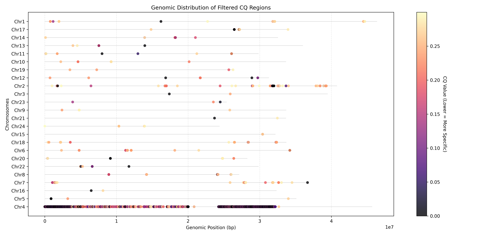

# CQ_tools

CQ_tools is a comprehensive bioinformatics pipeline designed for calculating and visualizing **CQ (Chromosome Quotient)** values from sequencing data. It supports genome alignment, automated window-based coverage calculation, and result visualization through both static images and interactive web reports.

## Features

- **Automated Alignment**: Integrated BWA MEM alignment and Samtools processing.
- **Windowed Analysis**: Flexible genomic window generation and coverage calculation using `bedtools`.
- **CQ Calculation**: Efficient CPM (Counts Per Million) normalization and CQ ratio calculation.
- **Unified Logging**: Centralized logging system for tracking progress and debugging.
- **Rich Visualization**:
  - High-resolution static plots (PNG/PDF).
  - Interactive HTML reports with hover details and zooming capabilities.

## Installation

### Prerequisites

- Python >= 3.11
- [BWA](http://bio-bwa.sourceforge.net/)
- [Samtools](http://www.htslib.org/)
- [bedtools](https://bedtools.readthedocs.io/)

### Setup

We recommend using `uv` for dependency management:

```bash
git clone https://github.com/yourusername/CQ_tools.git
cd CQ_tools
uv sync
```

Or install via `pip`:

```bash
pip install pandas matplotlib plotly pysam typer
```

## Usage

CQ_tools provides three main commands: `align`, `cq`, and `plot`.

### 1. Alignment (`align`)

Align reads to a reference genome and generate sorted BAM files.

```bash
uv run python main.py align 
    --fasta reference.fasta 
    --pair-1 sample_R1.fastq.gz 
    --pair-2 sample_R2.fastq.gz 
    --output-dir ./results 
    --cpu 8
```

#### Parameter Details:
| Parameter | Meaning | Default Value |
| :--- | :--- | :--- |
| `--fasta` | Path to the reference genome file (FASTA format) | (Required) |
| `--pair-1` | Path to the first pair of FASTQ reads | (Required) |
| `--pair-2` | Path to the second pair of FASTQ reads | (Required) |
| `--output-dir` | Directory where alignment results will be saved | (Required) |
| `--cpu` | Number of CPU cores to use for alignment | (Required) |

---

### 2. CQ Analysis (`cq`)

Calculate coverage, normalize data, and identify specific genomic regions.

```bash
uv run python main.py cq 
    --fasta reference.fasta 
    --f-bam female_sorted.bam 
    --m-bam male_sorted.bam 
    --output-dir ./cq_results 
```

#### CPM Calculation Principle
To ensure coverage is comparable between different samples with varying sequencing depths, the script performs **CPM (Counts Per Million)** normalization on the read counts of each window.

**Formula:**
$$CPM = \frac{\text{Reads in Window}}{\text{Total Mapped Reads in Sample}} \times 1,000,000$$

*   **Total Mapped Reads**: Obtained using `samtools view -c -F 4` to count all mapped reads in the BAM file.
*   **Scaling Factor**: The result is scaled by **$10^6$** to represent the number of reads per million mapped reads.

#### Parameter Details:
| Parameter | Meaning | Default Value |
| :--- | :--- | :--- |
| `--fasta` | Path to the reference genome file (used for indexing and windowing) | (Required) |
| `--f-bam` | Sorted BAM file for the Female sample | (Required) |
| `--m-bam` | Sorted BAM file for the Male sample | (Required) |
| `--output-dir` | Directory where CQ analysis results will be saved | (Required) |
| `--cq-value` | **CQ filtering threshold**. Calculated as `Female_CPM / Male_CPM`. Windows with a CQ value below this threshold are retained. | `0.3` |
| `--threshold` | **Male CPM filtering threshold**. Windows where the Male CPM (`M_CPM`) is less than or equal to this value are filtered out to exclude low-coverage noise. | `0` |
| `--parallel` | Parallel processing setting. `1`: Serial; `2`: Parallel (uses multiple processes for coverage calculation). | `2` |

---

### 3. Visualization (`plot`)

Generate distribution plots from existing CQ results.

```bash
uv run python main.py plot 
    --cq-result cq_results/F_M_CQ.filter.tsv 
    --chrom-length cq_results/chromosome_length.tsv 
    --output distribution.png 
```

#### Parameter Details:
| Parameter | Meaning | Default Value |
| :--- | :--- | :--- |
| `--cq-result` | Path to the filtered CQ result TSV file (`F_M_CQ.filter.tsv`) | (Required) |
| `--chrom-length` | Path to the chromosome length TSV file (`chromosome_length.tsv`) | (Required) |
| `--output` | Path to save the static distribution plot | `CQ_distribution.png` |
| `--pdf` | Whether to generate a high-resolution PDF version of the plot | `False` |
| `--html` | Whether to generate an interactive HTML report (supports zooming and hover details) | `True` |

#### Example Output Plot:


## Output Files

- `CQ.log`: Detailed execution log.
- `chromosome_windows.tsv`: Generated genomic windows (BED format).
- `F_M_CQ.filter.tsv`: Final filtered CQ results.
- `CQ_distribution.png`: Static genomic distribution plot.
- `CQ_distribution.html`: Interactive web-based report.

## Author

- **Author**: Yang Xiang
- **Email**: [georicl@outlook.com](mailto:georicl@outlook.com)
- **Date**: February 27, 2026

## License

MIT License
